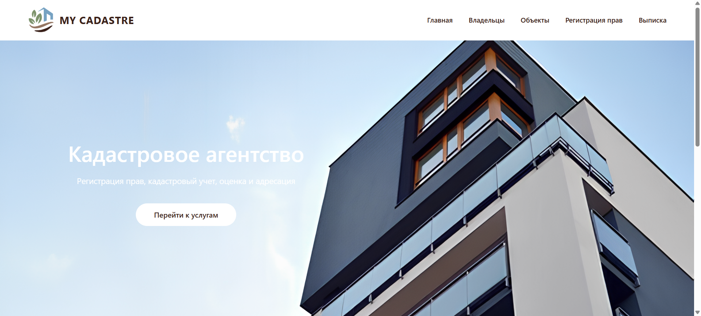
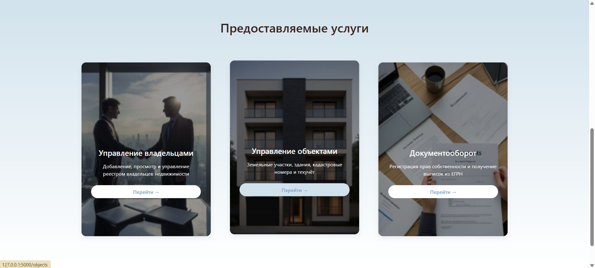
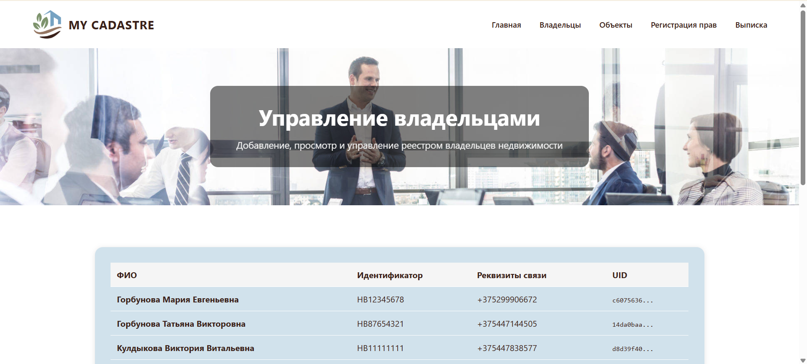
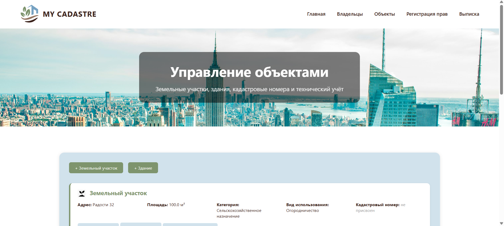
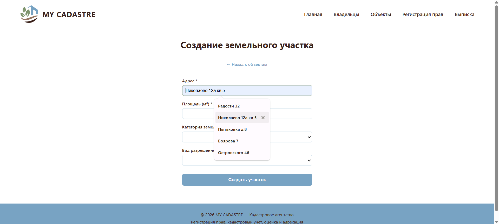
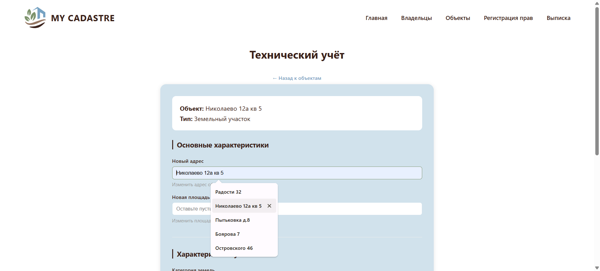
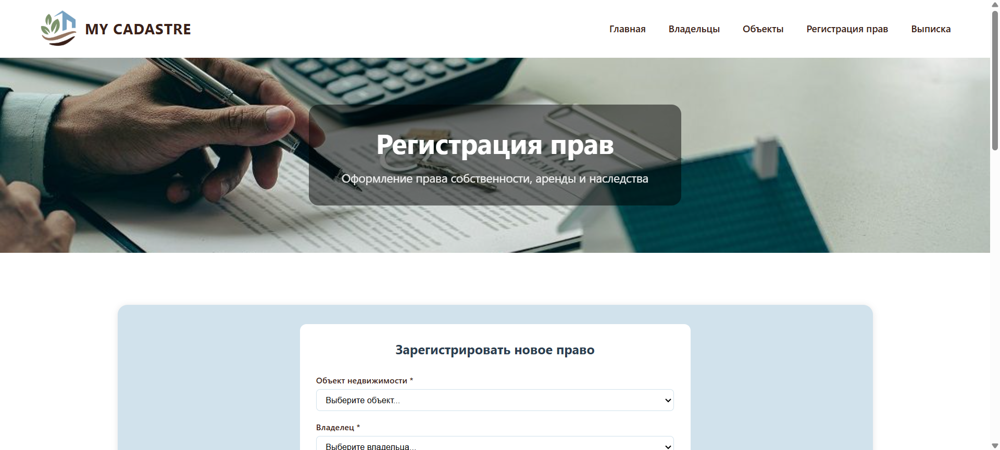
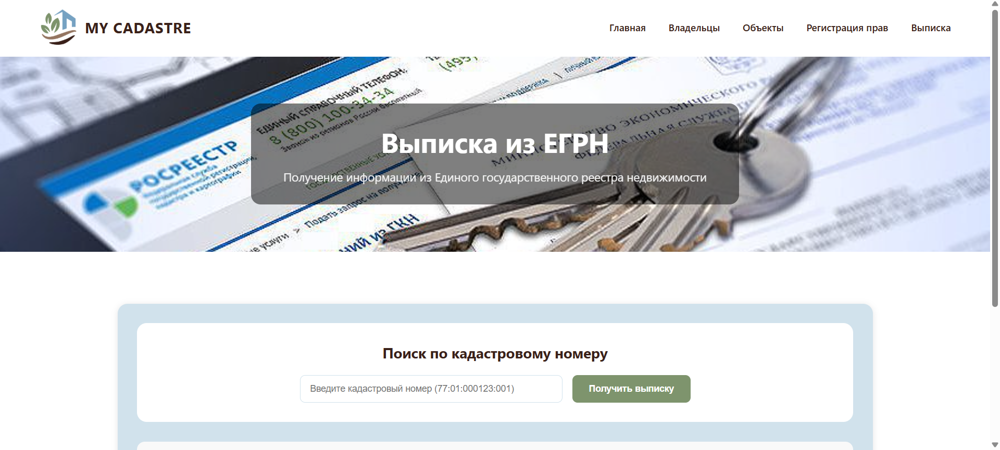
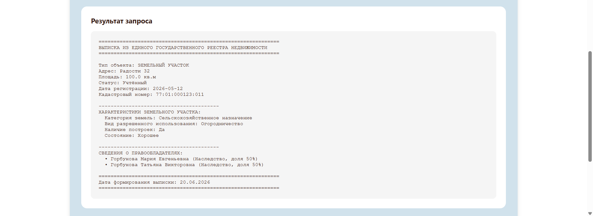

# MY CADASTRE - Кадастровое агентство

Веб-приложение для управления кадастровой системой "MY CADASTRE". Предоставляет полный функционал управления владельцами, объектами недвижимости, регистрацией прав и формированием выписок из ЕГРН через удобный веб-интерфейс.



*Предоставляемые услуги*


## Функциональность

### Управление владельцами
- Создание владельцев с идентификатором (ИНН/паспорт), ФИО и реквизитами связи
- Просмотр списка всех владельцев
- Валидация данных при создании



### Управление объектами недвижимости
- **Земельные участки**: адрес, площадь, категория земель, вид разрешенного использования
- **Здания**: адрес, площадь, этажность, материал стен, назначение, год постройки
- Присвоение кадастровых номеров (формат: 77:01:000123:001)
- Технический учёт объектов



*Создание земельного участка*


### Технический учёт
- Для зданий: этажность, материал стен, назначение, год постройки, физический износ, классы пожарной безопасности и энергоэффективности
- Для участков: категория земель, вид использования, наличие построек, состояние участка
- Автоматическая генерация номера технического паспорта



### Регистрация прав
- Регистрация права собственности, аренды, наследства
- Привязка к объекту и владельцу
- Указание доли в праве (0.01-1)
- Ввод правоустанавливающего документа (номер, дата, орган выдачи)



### Выписка из ЕГРН
- Поиск по кадастровому номеру
- Формирование полной выписки с информацией об объекте, владельцах и правах
- Просмотр объектов с присвоенными кадастровыми номерами



*Выписка по кадастровому номеру*


## Технологии

| Технология | Назначение |
|------------|------------|
| Python 3.9+ | Язык программирования |
| Flask 2.3 | Веб-фреймворк |
| HTML5 | Разметка страниц |
| CSS3 | Стилизация |
| Jinja2 | Шаблонизатор |
| JSON | Формат хранения данных |

## Структура проекта
```text
cadastre/
├── app.py # Главный файл приложения
├── models/ # Модели данных
│ ├── cadastral_number.py # Кадастровый номер
│ ├── object.py # Абстрактный объект
│ ├── zdanie.py # Здание
│ ├── zemelnyj_uchastok.py # Земельный участок
│ ├── vladetel.py # Владелец
│ ├── document.py # Правоустанавливающий документ
│ ├── pravovoy_document.py # Документ о праве
│ └── technical_passport.py # Технический паспорт
│
├── services/ # Сервисный слой
│ ├── kadastrovoe_agentstvo.py # Главный класс агентства
│ ├── object_repository.py # Репозиторий объектов
│ ├── owner_repository.py # Репозиторий владельцев
│ └── right_repository.py # Репозиторий прав
│
├── exceptions/ # Исключения
│ └── exceptions.py
│
├── data/ # JSON-файлы данных
│ ├── objects.json
│ ├── owners.json
│ └── rights.json
│
├── templates/ # HTML-шаблоны
│ ├── base.html # Базовый шаблон
│ ├── index.html # Главная
│ ├── owners.html # Владельцы
│ ├── objects.html # Объекты
│ ├── rights.html # Регистрация прав
│ ├── extract.html # Выписка
│ ├── create_owner.html # Создание владельца
│ ├── create_land.html # Создание участка
│ ├── create_building.html # Создание здания
│ └── technical_accounting.html # Технический учёт
│
├── static/
│ └── css/
│ └── style.css # Стили
│
├── requirements.txt
└── README.md
```

## Маршруты API

### Страницы (HTML)

| Метод | URL | Назначение |
|-------|-----|------------|
| GET | `/` | Главная страница |
| GET | `/owners` | Список владельцев |
| GET | `/objects` | Список объектов |
| GET | `/rights` | Регистрация прав |
| GET | `/extract` | Выписка из ЕГРН |

### API эндпоинты (Flask Routes)

| Метод | URL | Назначение |
|-------|-----|------------|
| POST | `/owner/create` | Создать владельца |
| POST | `/object/create/land` | Создать участок |
| POST | `/object/create/building` | Создать здание |
| POST | `/right/register` | Зарегистрировать право |
| POST | `/cadastral/assign/<id>` | Присвоить кадастровый номер |
| GET/POST | `/technical/accounting/<id>` | Технический учёт |
| GET/POST | `/extract` | Получить выписку |
| POST | `/document/update/<id>` | Обновить документацию |
